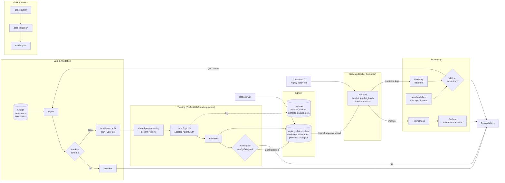

# System Architecture

## ส่วนประกอบ

| ชั้น | เครื่องมือ | ผู้รับผิดชอบ |
|---|---|---|
| Data & Validation | pandas, Pandera, SHA-256 data version | พีรพงษ์ |
| Features & Modeling | scikit-learn Pipeline, LightGBM, SHAP | ธันว์ |
| Tracking, Registry & Pipeline | MLflow, Prefect | กิตตินันท์ |
| Serving & Infra | FastAPI, uvicorn, Docker Compose, Locust | ภูรินทร์ |
| Monitoring | Evidently, Prometheus, Grafana | ฑีฌานนท์ |
| CI/CD | GitHub Actions, ruff, pytest | ณันทพงศ์ |
| Alerting | Discord webhook | ทุกส่วน |
