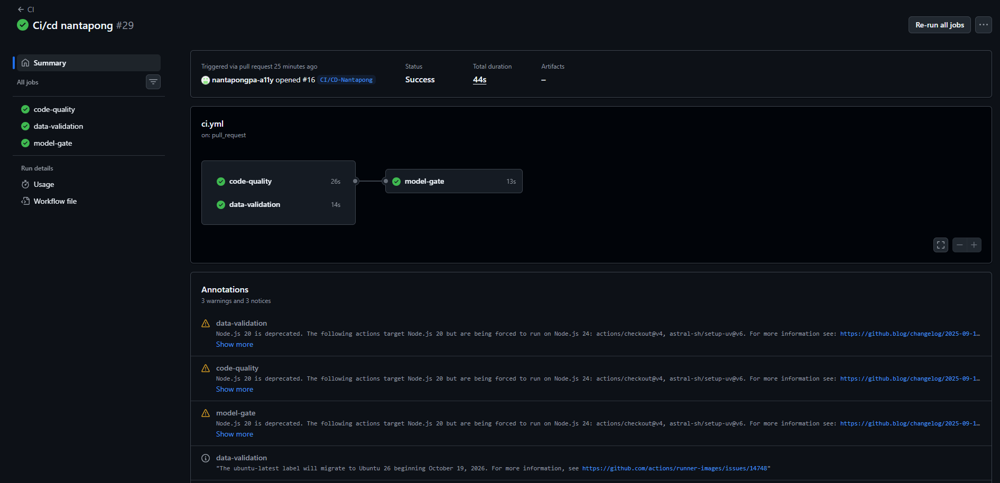
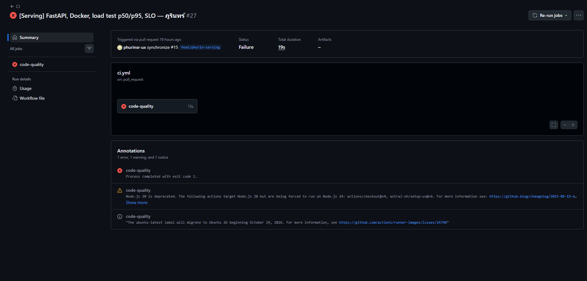
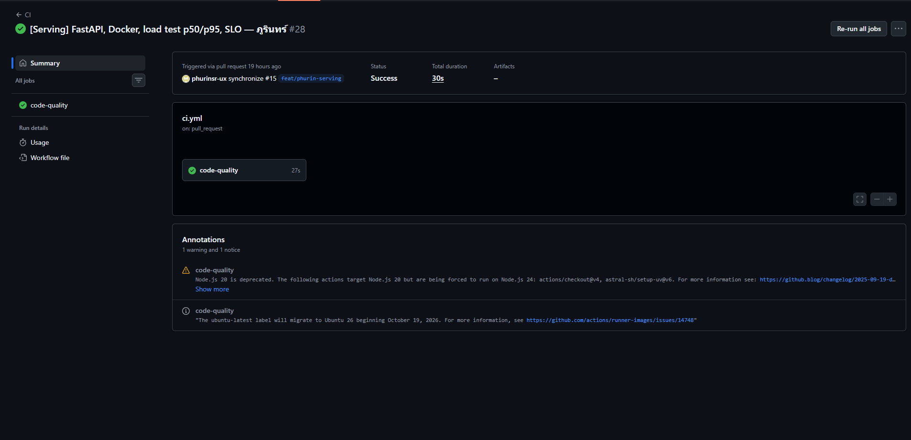
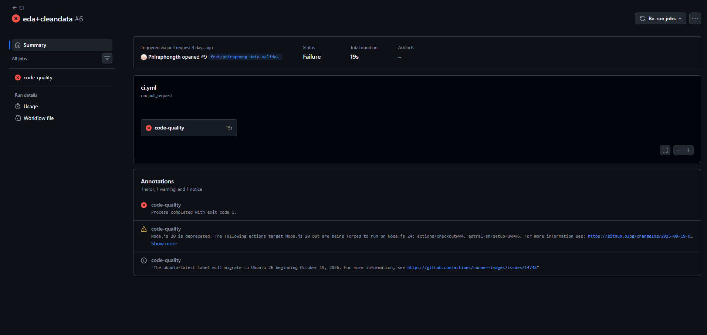
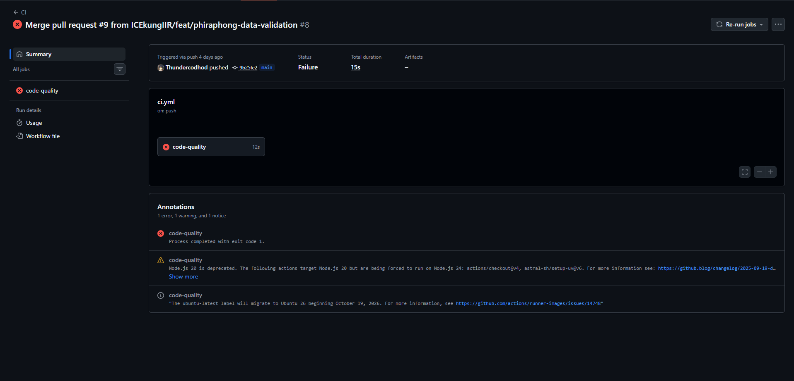
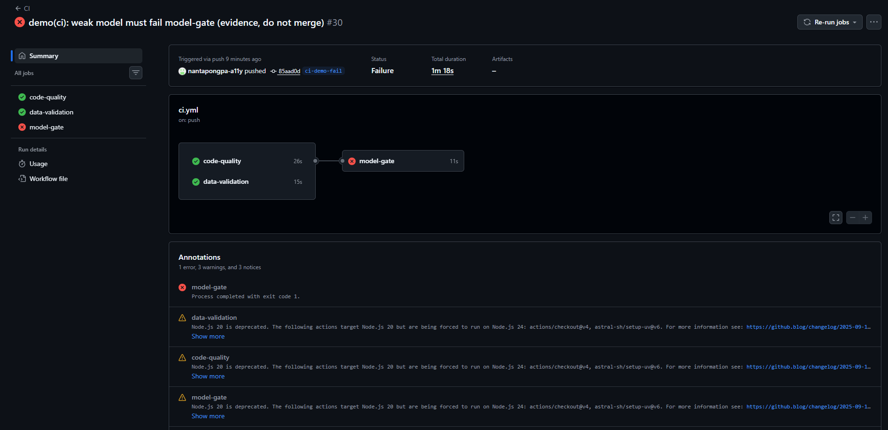
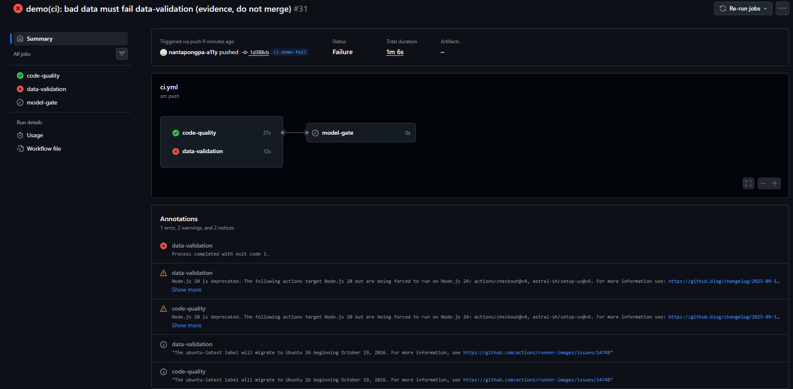

# CI/CD: 3 checks + tests (Issue #5)

ผู้รับผิดชอบ: ณันทพงศ์ (@nantapongpa-a11y)

## แนวคิด (Lecture 10: CI/CD for ML)

Lecture 10 บอกว่า ML CI/CD ต้องทดสอบ 3 อย่าง คือ **Code, Data, Model**
workflow นี้จึงแบ่งเป็น 3 jobs ตามนั้น

| สิ่งที่ต้องทดสอบ (L10) | Job | ทำอะไร |
|---|---|---|
| Code: Unit / Integration tests | `code-quality` | ruff (lint) + pytest |
| Data: Schema Validation | `data-validation` | ข้อมูลดีต้องผ่าน schema, ข้อมูลเสียต้องถูกปฏิเสธ |
| Model: Performance Validation | `model-gate` | เทียบ metric ของโมเดลที่ทีมเลือกกับ gate ใน `configs/slo.yaml` |
| Model: Infrastructure Compatibility | (pytest) | โมเดลที่ save แล้ว load กลับมาได้ และทำนายได้ผลเดิม |

ทั้งหมดนี้รันเมื่อเปิด Pull Request ตาม MLOps Level 2 ใน L10:
PR เรียก CI อัตโนมัติ ถ้าไม่ผ่าน PR จะขึ้นกากบาทแดง และไม่ควร merge

## โครงสร้าง workflow (Lecture 9: GitHub Actions)

ไฟล์ `.github/workflows/ci.yml`

- `name: CI` คือชื่อ workflow
- `on: pull_request` และ `push` เข้า `main` คือ trigger
- `jobs:` มี 3 jobs แต่ละ job รันบน runner `ubuntu-latest` ของตัวเอง
- `steps:` ใช้ `uses:` เรียก action สำเร็จรูป (checkout, setup-uv) และใช้ `run:` สั่งคำสั่ง
- `needs: [code-quality, data-validation]` ทำให้ `model-gate` รันหลังสอง job แรกผ่านแล้วเท่านั้น

```
code-quality ────┐
                 ├──> model-gate
data-validation ─┘
```

ทุก job เริ่มด้วย `uv sync --frozen` ติดตั้ง library ตาม `uv.lock` ทุกเวอร์ชัน
จึงได้ environment เดิมทุกครั้ง (Reproducible ตาม L10)

## Job 1: `code-quality`

| ขั้นตอน | คำสั่ง | ไม่ผ่านเมื่อ |
|---|---|---|
| Lint | `ruff check .` | โค้ดผิดกฎ เช่น import ที่ไม่ได้ใช้ |
| Format | `ruff format --check .` | โค้ดยังไม่ได้ format |
| Tests | `pytest -q` | มี test ที่ fail |

Test ที่ผมเขียนเพิ่ม (ไฟล์ `tests/test_ci_*.py`)

| ไฟล์ | ประเภท | ตรวจอะไร |
|---|---|---|
| `test_ci_schema.py` | Data / schema | ค่าผิดทีละคอลัมน์ต้องถูกปฏิเสธ, ขาดคอลัมน์, มีคอลัมน์เกิน, ข้อมูลว่าง, วันที่อ่านไม่ได้ |
| `test_ci_preprocessing.py` | Unit (preprocessing) | `clean()` ตัดแถวที่จองหลังวันนัด, ไม่แก้ข้อมูลต้นฉบับ, age group, lead time ติดลบกลายเป็น 0, ผู้ป่วยใหม่ไม่มีประวัติ, output เป็นตัวเลขไม่มี NaN |
| `test_ci_api_cases.py` | Integration (API) | ส่ง 18 เคสเข้า `/predict` ผ่าน FastAPI TestClient: เคสปกติต้องได้ 200, เคสผิดปกติต้องได้ 422 |
| `test_ci_model_artifact.py` | Infrastructure compatibility | train โมเดลที่ทีมเลือกด้วยข้อมูลจำลอง, save แบบ `train.py`, load แบบ serving แล้วผลต้องตรงกัน และขนาดไม่เกิน gate |
| `test_ci_model_gate.py` | Model gate | โมเดลที่ commit ไว้ต้องผ่าน, PR-AUC หรือ recall ต่ำต้องถูกบล็อก |

Test เดิมของเพื่อน (`test_data.py`, `test_features.py`, `test_serving_*.py` ฯลฯ) รันอยู่ในงานนี้ด้วย โดยผมไม่ได้แก้ไฟล์เหล่านั้น

## Job 2: `data-validation`

แนวคิดจาก Lecture 4 (SchemaGen / ExampleValidator): schema คือ "พิมพ์เขียว" ของข้อมูล
ใช้ตรวจปัญหาของข้อมูลตั้งแต่ต้น ป้องกัน *Garbage In, Garbage Out*
โปรเจกต์นี้ใช้ Pandera (`RAW_SCHEMA` ใน `src/noshow/data/schema.py`) ทำหน้าที่เดียวกับ ExampleValidator

```bash
uv run python -m noshow.ci.data_validation tests/fixtures/good_data.csv
uv run python -m noshow.ci.data_validation tests/fixtures/bad_data.csv --expect-fail
uv run python -m noshow.ci.data_validation tests/fixtures/bad_data_cases.csv --expect-fail
```

- `good_data.csv` ต้อง **ผ่าน**
- `bad_data.csv` และ `bad_data_cases.csv` ต้อง **ไม่ผ่าน** ถ้าหลุดผ่านได้ แปลว่า schema หลวมเกินไป job จะ fail
- `--expect-fail` สลับความหมายของ exit code: ไฟล์ถูกปฏิเสธจึงจะนับว่า "ผ่าน"

| Fixture | ปัญหาในไฟล์ |
|---|---|
| `bad_data.csv` (ของเดิม) | Gender `X`, อายุ 500, No-show `Maybe` |
| `bad_data_cases.csv` (ผมเพิ่ม) | อายุ 150, Scholarship `2`, Handcap `7`, AppointmentID ซ้ำ, PatientId ติดลบ, SMS_received `3` |

กฎที่ใช้ตรวจเหมือนกับ task `validate` ใน Prefect pipeline: ข้อมูลไม่ว่าง, ผ่าน `RAW_SCHEMA` และวันที่ต้องอ่านได้
ผมเขียนกฎชุดนี้ไว้ใน `src/noshow/ci/` แยกต่างหาก และไม่ได้แก้ไฟล์ pipeline ของเพื่อน

## Job 3: `model-gate`

แนวคิดจาก Lecture 7 และ Lecture 12

- **Gating (Satisficing) metric** (L7): เกณฑ์ผ่าน/ไม่ผ่าน โมเดลต้องผ่านทุกข้อจึงจะยอมรับ
- **Quality Gate / Evaluator** (L12): ใช้ **Absolute threshold** (เช่น AUC ต้อง > ค่าที่กำหนด)
  และ **Relative threshold** (ต้องดีกว่าโมเดลที่ใช้อยู่)

```bash
uv run python -m noshow.ci.model_gate
```

CI ไม่มีข้อมูลจริงและไม่มี MLflow server จึงตรวจ metric ที่ทีม modeling บันทึกไว้ใน `docs/model_results.json`

1. โมเดลที่เลือกและ SHA256 ของข้อมูลต้องตรงกับ `configs/params.yaml` เพื่อยืนยันว่าเป็นผลของโมเดลกับข้อมูลชุดที่ตกลงกันจริง
2. Absolute threshold จาก `configs/slo.yaml`
   - validation PR-AUC >= `gate.min_pr_auc` (0.298904)
   - validation no-show recall >= `gate.min_noshow_recall` (0.60)

ผลตอนนี้: `exp2_lightgbm_balanced` PR-AUC 0.3399, recall 0.8025 จึง **ผ่าน**

Relative threshold (`must_beat_production`) และขนาดไฟล์โมเดลจริง ต้องใช้ MLflow registry
จึงตรวจใน registry gate ของ pipeline (`noshow.registry.gate`) ซึ่งเป็นงานของเพื่อน

## รันในเครื่องก่อนเปิด PR

```bash
uv run ruff check .
uv run ruff format --check .
uv run pytest -q
uv run python -m noshow.ci.data_validation tests/fixtures/good_data.csv
uv run python -m noshow.ci.data_validation tests/fixtures/bad_data.csv --expect-fail
uv run python -m noshow.ci.model_gate
```

## หลักฐาน CI (ผ่าน / ไม่ผ่าน)

### ผ่าน: PR #16 (งานนี้)

| Run | ผล |
|---|---|
| [https://github.com/KKU-Noshow-clinic/clinic-noshow-prediction/actions/runs/37118805815](https://github.com/KKU-Noshow-clinic/clinic-noshow-prediction/actions/runs/37118805815) | `code-quality` ✅, `data-validation` ✅, `model-gate` ✅ |



### ไม่ผ่าน (A): CI จับปัญหาจริงในงานของทีม

ก่อนจะมีงานนี้ workflow มีแค่ `code-quality` แต่ CI ก็จับปัญหาจริงได้แล้ว 2 ครั้ง

**1. Serving: CI จับ bug ที่ทำให้ API ไม่ส่งผลทำนายกลับ**

| Run | Commit | ผล |
|---|---|---|
| [https://github.com/KKU-Noshow-clinic/clinic-noshow-prediction/actions/runs/37031890088](https://github.com/KKU-Noshow-clinic/clinic-noshow-prediction/actions/runs/37031890088) | `21d3193` | ❌ Lint: `F841 Local variable results is assigned to but never used` (`src/noshow/serving/app.py:115`) |
| [https://github.com/KKU-Noshow-clinic/clinic-noshow-prediction/actions/runs/37032877777](https://github.com/KKU-Noshow-clinic/clinic-noshow-prediction/actions/runs/37032877777) | `f005699` | ✅ หลังแก้ |

ใน commit `21d3193` ฟังก์ชัน `_score()` คำนวณ `results` แล้วไม่ได้ `return` ออกไป (เหลือโค้ด debug ค้างไว้)
ถ้า merge ไป `/predict` จะไม่ได้ผลทำนาย ruff ตรวจเจอว่าตัวแปร `results` ไม่ถูกใช้ CI จึง fail
เจ้าของงานแก้ใน commit `f005699` (คืนค่า `results`) แล้ว CI ผ่าน




นี่คือตัวอย่างที่ Lecture 10 บอกว่า "ทุกการเปลี่ยนแปลงถูกทดสอบผ่านระบบอัตโนมัติก่อนเสมอ"

**2. Data: PR ถูก merge ทั้งที่ CI ยังแดง ทำให้ `main` แดงตาม**

| Run | Event | ผล |
|---|---|---|
| [https://github.com/KKU-Noshow-clinic/clinic-noshow-prediction/actions/runs/36578454159](https://github.com/KKU-Noshow-clinic/clinic-noshow-prediction/actions/runs/36578454159) | PR (`12429d5`) | ❌ Lint: `E501 Line too long` (`scripts/eda.py:104`) |
| [https://github.com/KKU-Noshow-clinic/clinic-noshow-prediction/actions/runs/36587968341](https://github.com/KKU-Noshow-clinic/clinic-noshow-prediction/actions/runs/36587968341) | push `main` หลัง merge PR #9 | ❌ `main` แดง |
| [https://github.com/KKU-Noshow-clinic/clinic-noshow-prediction/actions/runs/36591924613](https://github.com/KKU-Noshow-clinic/clinic-noshow-prediction/actions/runs/36591924613) | push `main` หลังแก้ | ✅ |




บทเรียน: CI จะมีประโยชน์ก็ต่อเมื่อทีมไม่ merge PR ที่ยังแดง
ควรตั้ง branch protection ให้ `main` บังคับว่า CI ต้องผ่านก่อน merge (ต้องให้ admin ของ repo ตั้งค่า)

### ไม่ผ่าน (B): ทดสอบว่า job ใหม่บล็อกได้จริง

ใช้ branch ทิ้ง `ci-demo-fail` แก้เฉพาะ `ci.yml` ให้ป้อนของเสียเข้าไป (ไม่ merge)

| Run | ป้อนอะไร | ผล |
|---|---|---|
| [https://github.com/KKU-Noshow-clinic/clinic-noshow-prediction/actions/runs/37119537630](https://github.com/KKU-Noshow-clinic/clinic-noshow-prediction/actions/runs/37119537630) | โมเดลแย่ `bad_model_results.json` (PR-AUC 0.25, recall 0.55) | `code-quality` ✅, `data-validation` ✅, `model-gate` ❌ |
| [https://github.com/KKU-Noshow-clinic/clinic-noshow-prediction/actions/runs/37119548971](https://github.com/KKU-Noshow-clinic/clinic-noshow-prediction/actions/runs/37119548971) | ข้อมูลเสีย `bad_data_cases.csv` แทนข้อมูลดี | `code-quality` ✅, `data-validation` ❌, `model-gate` ⏭ skipped (เพราะ `needs`) |




## Test cases สำหรับวันนำเสนอ

`tests/fixtures/api_cases.json` มี 18 เคส (ปกติ 7, ผิดปกติ 11)
เคสชุดเดียวกันนี้รันใน CI ด้วย (`test_ci_api_cases.py`) จึงมั่นใจได้ว่าวันนำเสนอผลจะเป็นตามที่คาด

```bash
docker compose up -d --build
uv run python scripts/demo_cases.py
```

| ประเภท | เคส | คาดหวัง |
|---|---|---|
| ปกติ | นัดทั่วไป, จองวันเดียวกัน, นัดล่วงหน้า 60 วัน, อายุ 0, วันที่ไม่มีเวลา, ย่านใหม่/ตัวพิมพ์เล็ก, Handcap 3 | 200 + คะแนน |
| ผิดปกติ | Gender `X`, อายุ -1 / 150 / `"old"`, SMS_received 2, จองหลังวันนัด, วันที่อ่านไม่ได้, ไม่ส่ง Age, ส่ง `No-show` มาด้วย (label leakage), PatientId 0, Neighbourhood ว่าง | 422 |

script ยังตรวจไฟล์ CSV ทั้ง 3 ไฟล์ให้ดูด้วยว่าเจอปัญหาอะไรบ้าง
